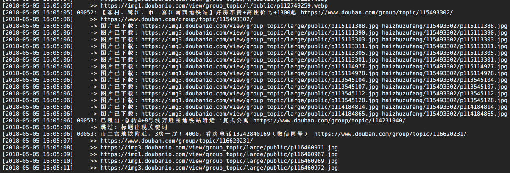

# douban-tiny-spider

## 豆瓣小爬虫

豆瓣小爬虫, 针对豆瓣小组(租房). 单PHP文件, 无数据库, 移动端友好, 逻辑简单.

## 特性

- 单PHP文件, 部署简单
- 无数据库, 即爬即用
- 移动端友好的租房信息
- 爬过的图片不会再爬一次
- 严格规范的代码风格, 注释完整

## 反爬

- 每分钟换一次 User-Agent 和 Cookie
- 每爬一次睡眠 1 秒, 时间可调整

> 注: 爬慢点不会被封, 1秒其实还是太快了, 加个代理再爬吧~

## 用法

天河租房:
http://hostname/tianhezufang.html
```
php spider.php tianhezufang
```

越秀租房:
http://hostname/yuexiuzufang.html
```
php spider.php yuexiuzufang
```

海珠租房:
http://hostname/haizhuzufang.html
```
php spider.php haizhuzufang
```

番禺租房:
http://hostname/panyuzufang.html
```
php spider.php panyuzufang
```

(小组名):
http://hostname/group_name.html
```
php spider.php group_name
```

## 运行截图



(更多效果图待完善)
